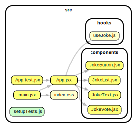

# Bad Joke or Dad Joke

## Overview

Dad jokes have been around for…..well….as long as dads have been around for….and that's a while.

No matter how much we may pretend to hate the jokes, every once in a while there's one that'll get ya, and you can't help but laugh. For this challenge, we are going to make use of: `"https://official-joke-api.appspot.com/random_joke"`. This API will return a random joke, but it's up to you to decide if it's a good joke or a bad joke.

The app will be very simple, but it will solve a VERY serious problem. The dad joke API has a large database of dad jokes, but most of them are terrible. This app will fetch a random dad joke, and then the user will be able to down vote the joke if it's not funny or upvote the joke if it's a truly worthy joke. The jokes will then be sorted into Bad and Good lists on the screen.

## Requirements

- [ ] The app should have a button that says "Get Joke" that will fetch a random joke from the API.
- [ ] The app should have an upvote button that will upvote the joke.
- [ ] The app should have a downvote button that will downvote the joke.
- [ ] Whenever we fetch a new joke, the app should display the joke in a text view.
- [ ] Whenever we click the upvote button, the joke should be cleared and moved to the Good Jokes list.
- [ ] Whenever we click the downvote button, the joke should be cleared and moved to the Bad Jokes list.
- [ ] The app should have a Good Jokes list that will display all the jokes that have been upvoted.
- [ ] The app should have a Bad Jokes list that will display all the jokes that have been downvoted.
- [ ] if we don't vote on a joke, it should not be added to either list. We can just fetch a new joke.

## Testing ✅

Run the tests: `npm t`. They will be failing ❌ at first, of course 🙄.

If your app passes the tests ✅, then it's working as expected.

You may wish to add more tests ✅, but not required.

## Suggested Architecture 🏗️

You can add more components if you want, but this is the minimum required to complete the challenge. You should also use a custom 🪝 as shown.

## Example Deployment

[Example Deployment](https://kodeden-bad-dad-joke.netlify.app/)

Be creative. Don't just copy the example. Make it your own.

## Tips

You should not need any `useEffect` here. Recall that when we talked about `useEffect` we discouarged the use of `useEffect` except in a few select situations. In this scenario, we don't wish to `fetch` any data simply because the page is loaded. We only fetch in response to `onClick`. `useEffect` has no place in our ~~society~~ app.
